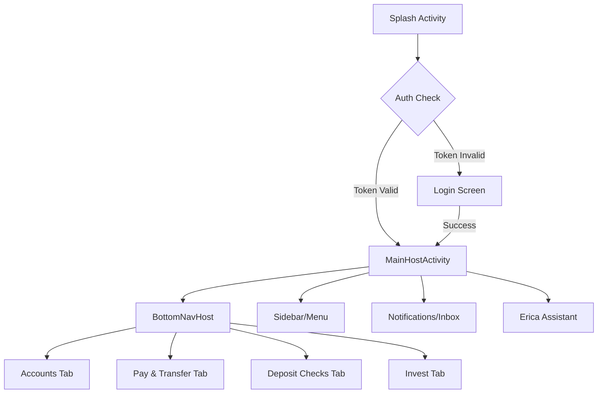

# UI/UX Flow & Screen Inventory

## 1. Navigation Map

## 2. Screen Detailed Analysis & Layouts

### 2.1 Splash Screen
*   **Layout:** `Box(contentAlignment = Center)` containing the Vector Logo.
*   **Transition:** Crossfade to Login after 1500ms.
*   **System UI:** Edge-to-edge enabled; transparent status bar.

### 2.2 Login Screen
*   **Components:**
    *   `Column` (Scrollable).
    *   `BankOfAmericaLogo` (Asset).
    *   `OutlinedTextField` for User ID (InputVisualTransformation for masking).
    *   `SecureTextField` for Password.
    *   `Button` (Primary) "Logic In".
    *   `FlowRow` for Quick Links (Biometrics, Forgot Password).
    *   `LazyVerticalGrid` for Promo Cards (Credit Card offer, Savings).

### 2.3 Accounts / Dashboard (Home)
*   **Top App Bar:** Custom implementation. Hamburger (Left), Inbox/Products/Logout (Right). Search Bar pinned below.
*   **TabRow:** Sticky Header functionality.
*   **Content:** `LazyColumn` containing:
    *   `GreetingSection` (Text).
    *   `ExpandableCard` for Banking Accounts (Row with Text, Balance, Chevron).
    *   `ExpandableCard` for Credit Cards.
    *   If Tab == Dashboard: `LazyVerticalGrid` (2 columns) for Spending, FICO, Rewards items.

### 2.4 Deposit Checks
*   **Layout:** `Column` with `Modifier.verticalScroll`.
*   **Capture Section:** Two `Surface` components acting as buttons (Front/Back). Dynamic state change from Icon -> Captured Image Thumbnail.
*   **Inputs:** `ExposedDropdownMenuBox` for Account Selection. `BasicTextField` with Currency formatting for Amount ($0.00).
*   **Footer:** Fixed `Button` ("Now") or scrollable if content exceeds height.

## 3. Accessibility Guidelines
*   **TalkBack Labels:**
    *   Login User ID: "User ID input, currently masked. Double tap to edit."
    *   Deposit Capture: "Front of check camera trigger. No image captured."
    *   Erica Floating Button: "Erica Assistant, 3 unread suggestions."
*   **Focus Order:** Must traverse TopBar -> Search -> TabRow -> Main Content -> BottomNav.
*   **Semantic Groups:** Account list items (Name + Balance) must be merged into a single focusable node.